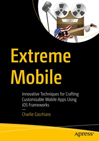

# Extreme Mobile Source Code

This repository contains the Xcode project files and final source code built throughout [*Extreme Mobile: Innovative Techniques for Crafting Customizable Mobile Apps Using iOS Frameworks*](https://www.link.springer.com/book/10.1007/979-8-8688-2323-7) by Charlie Cocchiaro (Apress, 2026).

[comment]: #cover

## To download the code:

1. Open the repository on GitHub
2. Confirm you are on the **Code** tab
3. Look just below the tab bar: a branch selector and commit summary appear above the file list
4. On the **right side of this section**, aligned with the top of the file list, locate the **Code** button
5. Select the button to access cloning options and the option to download the repository as a ZIP file

## Releases

Release v1.0 corresponds to the code in the published book, without corrections or updates.

## Contributions

See the file Contributing.md for more information on how you can contribute to this repository.
